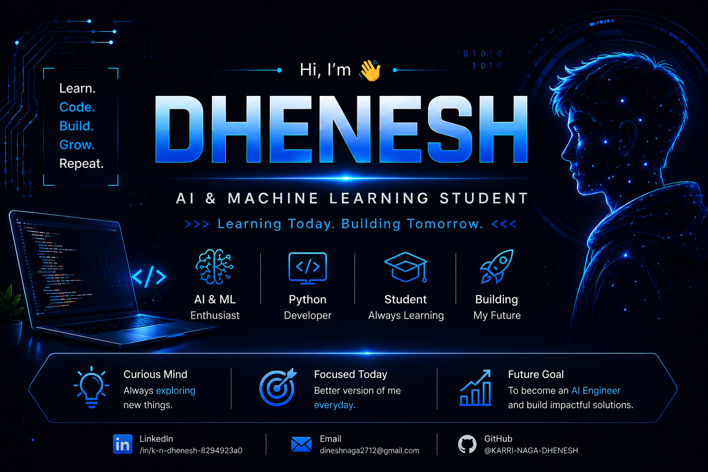

<p align="center">
  
</p>

<p align="center">
  
</p>

<p align="center">


</p>

<h1 align="center">
Hi 👋 I'm Dhenesh
</h1>

<h3 align="center">
AI & Machine Learning Student • Python Developer • Building AI Projects
</h3>

<p align="center">

I am a passionate <b>3rd Year AI & Machine Learning student</b> who enjoys building intelligent applications, exploring new AI technologies, and solving real-world problems through software development.

</p>

---

# 🚀 About Me

- 🎓 B.Tech Student (AI & Machine Learning)
- 🐍 Python Developer
- 🤖 Exploring AI, Machine Learning, Deep Learning & AI Agents
- 🛡️ Building AI-powered Cybersecurity & Healthcare Applications
- 🌱 Learning one new technology every day
- 📚 Currently improving DSA, Cloud Computing & MLOps
- 🎯 Goal: Become an AI Engineer and build impactful AI solutions

---

# 💻 Tech Stack

## 👨‍💻 Programming Languages

<p align="center">


</p>

---

## 🤖 AI / Machine Learning

<p align="center">


</p>

<p align="center">


</p>

---

# 🤖 AI Tools

<p align="center">


</p>

---

# ⚒️ Developer Tools

<p align="center">


</p>

---

# 🚀 Featured Projects

## 🛡️ CyberVerse-AI

> AI-powered Cybersecurity Platform

### ✨ Features

- 🤖 AI Copilot
- 📄 Log Analyzer
- 🦠 Malware Classification
- 🎣 Phishing Detection
- 🌍 Threat Intelligence
- 📊 Security Dashboard
- 📑 AI Incident Report Generator

**Repository**

https://github.com/KARRI-NAGA-DHENESH/CyberVerse-AI

---

## 🏥 AI Medical Assistant

> AI-powered Healthcare Assistant

### ✨ Features

- 🩺 Disease Prediction
- 💊 Health Recommendations
- 🤖 AI Medical Chat Assistant
- 📈 Health Dashboard
- 👨‍⚕️ User-friendly Interface

**Repository**

# 📚 Currently Learning

<p align="center">


</p>

---

# 🎯 2026 Goals

- 🚀 Build 5+ High Quality AI Projects
- 💻 Solve 300+ LeetCode Problems
- 🤖 Master AI Agents & Generative AI
- 🌱 Contribute to Open Source
- ☁️ Learn MLOps & Cloud Deployment
- 💼 Become Placement Ready

---

# 📌 Featured Repositories

<p align="center">

<a href="https://github.com/KARRI-NAGA-DHENESH/CyberVerse-AI">

</a>

<a href="https://github.com/KARRI-NAGA-DHENESH/YOUR_MEDICAL_ASSISTANT_REPO_NAME">

</a>

</p>

---

# 🌐 Connect With Me

<p align="center">

<a href="https://www.linkedin.com/in/k-n-dhenesh-8294923a0">

</a>

&nbsp;

<a href="mailto:dineshnaga2712@gmail.com">

</a>

&nbsp;

<a href="https://github.com/KARRI-NAGA-DHENESH">

</a>

</p>

---

# 📊 GitHub Statistics

<p align="center">


</p>

---

# 🔥 GitHub Streak

<p align="center">


</p>

---

# 🏆 GitHub Achievements

<p align="center">


</p>

---

# 📈 Contribution Graph

<p align="center">


</p>

---

# 📋 GitHub Profile Summary

<p align="center">


</p>

---

# 🐍 Contribution Snake

<p align="center">


</p>

---

# 💡 Favorite Quote

<p align="center">


</p>

---

# ☕ Fun Fact

```python
while True:
    learn()
    build()
    improve()
```

---

<p align="center">

⭐ **Thanks for visiting my profile!**

### 🚀 Learning Every Day • Building AI Projects • Growing One Commit at a Time


</p>


---
